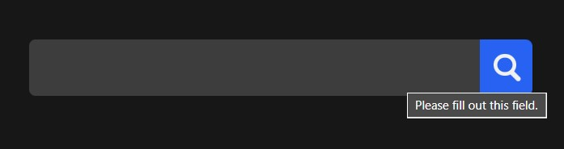

# Animated Search Box 🔍

Animated Search Box is a stylish and interactive search input field with animation effects.

## Preview 🖼️

## Technologies Used 🛠️

- HTML
- CSS

## Features ✨

- Sleek and modern design for enhancing user experience.
- Interactive animation effects to engage users.
- Customizable styles to fit your website's theme.
- Optional JavaScript for adding dynamic functionality or additional animation effects.

## Usage 🚀

1. Include the necessary HTML markup for the animated search box in your project.
2. Use CSS to style the search box and animation effects according to your design preferences.
3. Optionally, add JavaScript to enhance the search box with dynamic functionality or additional animation effects.

## Contributing 🤝

Contributions are welcome! If you find any issues or have suggestions for improvements, feel free to open an issue or create a pull request.

## License 📝

This project is licensed under the MIT License.
