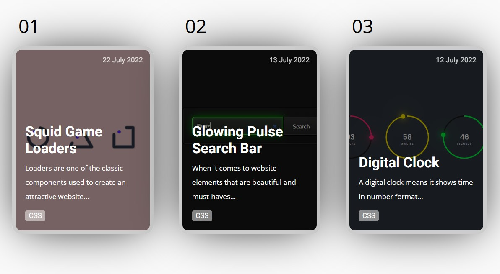
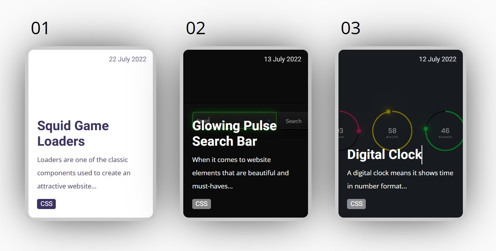

# Responsive Blog Card Collection 📚✨

Welcome to the Responsive Blog Card Collection repository! 🎉 If you're looking to create beautiful, responsive blog cards for your website, you've come to the right place! 🌟

## What's Inside?

Inside this repository, you'll discover a variety of elegantly designed blog cards that are fully responsive and customizable. Here's what you'll find:

- **Blog Cards**: A selection of blog card styles, perfect for showcasing your articles in a visually appealing way.
- **HTML & CSS**: Code snippets demonstrating how to implement each blog card design in your projects.

## How to Use?

Integrating these responsive blog cards into your website is easy! Just follow these steps:

1. Browse through the collection to find a blog card design that fits your aesthetic.
2. Copy the corresponding HTML and CSS code snippets into your project files.
3. Customize the blog card further by adjusting colors, fonts, and layouts to match your brand.
4. Optionally, add JavaScript for features like hover effects or lazy loading of images.

With these responsive blog cards, your blog section will look stunning on any device! 🌐📱💻

## SneakPeek

Get a sneak peek at the beautiful blog cards included in this collection:

## Get in Touch

Have questions, feedback, or want to share how you've used our blog cards in your projects? We'd love to hear from you! Connect with us on [GitHub](https://github.com/shivamgpt812). Let's collaborate and create stunning web experiences together! 💬🌐

Happy blogging! 📚💻
