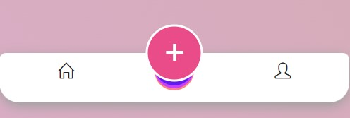
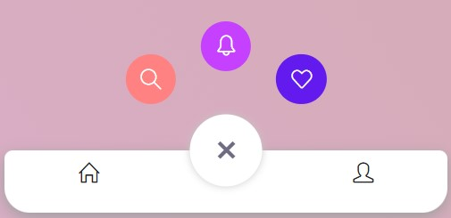

# Bottom Tab Bar Navigation 📱✨

Welcome to the Bottom Tab Bar Navigation repository! 🎉 Enhance your mobile web experience with our sleek and intuitive bottom tab bar navigation component. 🌟

## Overview

This repository provides a customizable and user-friendly bottom tab bar navigation solution for mobile web applications. With its modern design and seamless functionality, our bottom tab bar makes navigating your app a breeze.

## Features

- **Sleek Design**: A clean and modern bottom tab bar that complements your app's aesthetics.
- **Intuitive Navigation**: Easily switch between different sections or pages with a single tap.
- **Customizable Icons**: Choose from a variety of icons to represent each tab, or use your own custom icons.
- **Responsive**: Works seamlessly across various screen sizes and orientations.

## Installation

To integrate the Bottom Tab Bar Navigation into your project, follow these steps:

1. **Clone the Repository**:
    ```sh
    git clone https://github.com/shivamgpt812/bottom-tab-bar-navigation.git
    ```

2. **Include the Necessary Files**:
    Add the HTML and CSS files from the repository to your project directory.

3. **Link the CSS**:
    In your HTML file, include the CSS stylesheet:
    ```html
    <link rel="stylesheet" href="style.css">
    ```

4. **Add the HTML Markup**:
    Insert the bottom tab bar navigation's HTML structure into your webpage where you want the navigation to appear.

## Customization

You can easily customize the Bottom Tab Bar Navigation to match your app's style:

- **Colors**: Modify the CSS to change the tab bar's color scheme.
- **Icons**: Choose icons that best represent each tab, or create your own custom icons.
- **Labels**: Add labels to the tabs for clarity or remove them for a minimalist look.

## SneakPeek

Get a sneak peek at the Bottom Tab Bar Navigation included in this project:

- **Modern Design**: Clean and intuitive, perfect for mobile web applications.
- **Effortless Navigation**: Switch between tabs seamlessly with a single tap.
- **Flexible Configuration**: Customize the tab bar to suit your app's branding and functionality.




## Get in Touch

Have questions, feedback, or want to share how you've used our Bottom Tab Bar Navigation in your projects? We'd love to hear from you! Connect with us on [GitHub](https://github.com/shivamgpt812). Let's collaborate and create amazing mobile web experiences together! 💬📱

Happy navigating! 🚀✨