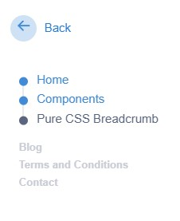

# Breadcrumb Navigation 🍞

Breadcrumb Navigation is a user interface element that provides users with a trail of links to navigate hierarchical website structures.

## Preview 🖼️

## Technologies Used 🛠️

- HTML
- CSS

## Features ✨

- Dynamic generation of breadcrumb links based on the current page's hierarchy.
- Responsive design for use on various devices and screen sizes.
- Customizable styles to match your website's theme.
- Optional JavaScript for adding dynamic functionality, such as collapsing long breadcrumb trails.

## Usage 🚀

1. Include the necessary HTML markup for the breadcrumb navigation in your project.
2. Customize the styles to match your website's design preferences.
3. Optionally, use JavaScript to enhance the breadcrumb navigation with dynamic functionality or additional features.

## Contributing 🤝

Contributions are welcome! If you find any issues or have suggestions for improvements, feel free to open an issue or create a pull request.

## License 📝

This project is licensed under the MIT License. 