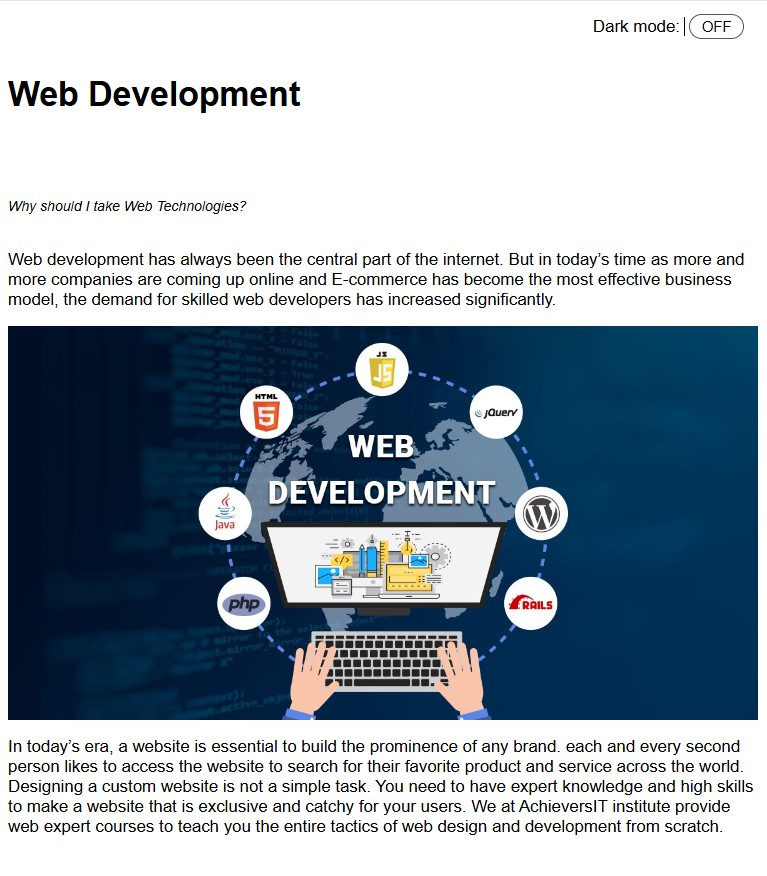
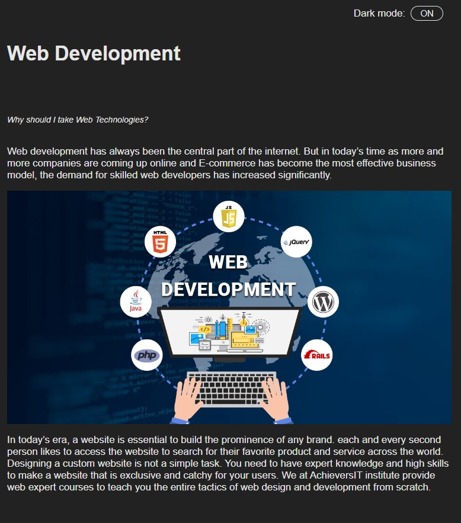

# Light Mode and Dark Mode Toggle 🌗

Light Mode and Dark Mode Toggle is a web application that allows users to switch between light and dark themes.

## Preview 🖼️

## Technologies Used 🛠️

- HTML
- CSS
- JavaScript

## Features ✨

- Light mode and dark mode themes for better user experience in different lighting conditions.
- Smooth transition between themes for a seamless user experience.
- User-friendly toggle button to switch between light and dark modes.
- Customizable styles to match your website's design.

## Usage 🚀

1. Open the web application in a browser to view the default light mode theme.
2. Use the toggle button to switch between light and dark modes.
3. Experience the smooth transition between themes and enjoy browsing in your preferred mode.

## Contributing 🤝

Contributions are welcome! If you find any issues or have suggestions for improvements, feel free to open an issue or create a pull request.

## License 📝

This project is licensed under the MIT License.
