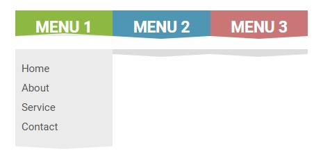

# Dropdown Menu 📋

Dropdown Menu is a customizable and user-friendly menu component for web applications.

## Preview 🖼️

## Technologies Used 🛠️

- HTML
- CSS

## Features ✨

- Customizable dropdown menu with support for nested items.
- Smooth animation effects for opening and closing the menu.
- Easily integrate into any web project.
- Option to style menu items and animations to fit your project's design.

## Usage 🚀

1. Include the necessary HTML markup for the menu in your project.
2. Use CSS to style the menu items and animations according to your design preferences.
3. Add JavaScript to handle the menu's functionality, such as opening and closing on user interaction.

## Contributing 🤝

Contributions are welcome! If you find any issues or have suggestions for improvements, feel free to open an issue or create a pull request.

## License 📝

This project is licensed under the MIT License.
