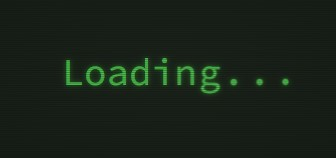
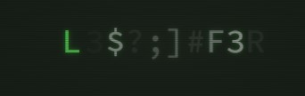

# Glitch Effect Tutorial 💥✨

Welcome to the Glitch Effect Tutorial repository! 🎉 In this tutorial, we'll learn how to create an awesome glitch effect using HTML, CSS, and JavaScript. Get ready to add some futuristic vibes to your web projects! 🚀

## What's Inside?

Inside this repository, you'll find everything you need to create your own glitch effect:

- `index.html`: The HTML file where the magic happens! ✨
- `style.css`: The CSS file responsible for styling our glitchy text. 🎨
- `script.js`: The JavaScript file containing the glitch effect logic. 💻

## How to Use?

Using the glitch effect in your own projects is super easy! Just follow these steps:

1. Clone this repository to your local machine.
2. Open `index.html` in your favorite web browser.
3. Watch in awe as the glitch effect transforms the text on your screen! 😍

Feel free to tweak the code, experiment with different settings, and make the glitch effect your own! Don't forget to share your creations with the world! 🌎✨

## Sneakpeak

## Get in Touch

If you have any questions, feedback, or just want to say hi, feel free to reach out! You can find me on [GitHub](https://github.com/shivamgpt812). Let's connect and create awesome things together! 🌟

Happy glitching! ✨💻