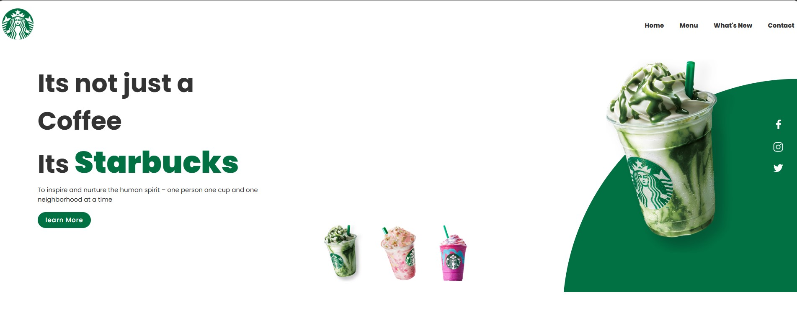

# Awesome Landing Page 🚀✨

Welcome to the Awesome Landing Page repository! 🎉 Create a stunning first impression with our sleek and captivating landing page template. 🌟

## Overview

This repository provides a customizable and visually appealing landing page solution for websites and web applications. With its modern design, smooth animations, and responsive layout, our landing page template helps you showcase your product or service effectively and attractively.

## Features

- **Modern Design**: Clean and stylish layout for a professional look.
- **Responsive**: Adapts seamlessly to various screen sizes and devices.
- **Customizable**: Easily adjust colors, images, and content to match your brand.
- **Call to Action**: Engage visitors with clear and compelling calls to action.
- **Smooth Animations**: Add interactivity and flair with smooth transition effects.

## Installation

To use the Awesome Landing Page template, follow these steps:

1. **Clone the Repository**:
    ```sh
    git clone https://github.com/shivamgpt812/awesome-landing-page.git
    ```

2. **Customize Content**:
    Modify the HTML and CSS files to replace placeholder content with your own text, images, and branding elements.

3. **Replace Images**:
    Replace the placeholder images in the `img` directory with your own high-quality images.

4. **Update Styles**:
    Customize the CSS styles to match your brand colors, typography, and design preferences.

5. **Deploy**:
    Upload the modified files to your web server or hosting provider to make your landing page live.

## Customization

You can easily customize the Awesome Landing Page template to fit your website's style and branding:

- **Colors**: Modify the CSS to change the color scheme and style elements.
- **Images**: Replace the placeholder images with your own product/service images.
- **Text**: Update the HTML content to reflect your unique value proposition and features.

## SneakPeek

Get a sneak peek at the Awesome Landing Page included in this project:

- **Modern Design**: Clean and professional layout for a polished look.
- **Responsive**: Adapts seamlessly to desktops, tablets, and smartphones.
- **Call to Action**: Engage visitors with clear and compelling calls to action.
- **Smooth Animations**: Add interactivity and flair with smooth transition effects.



## Get in Touch

Have questions, feedback, or want to share how you've used our Awesome Landing Page template? We'd love to hear from you! Connect with us on [GitHub](https://github.com/shivamgpt812). Let's collaborate and create amazing landing pages together! 💬🚀

Happy landing page building! ✨
