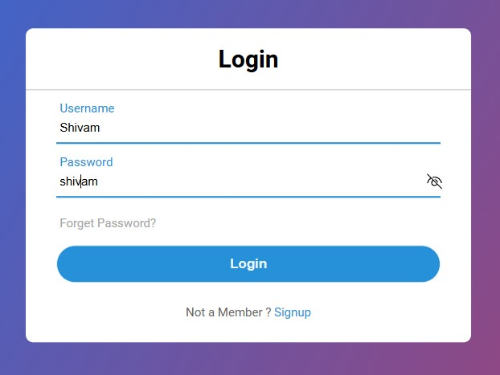

# Login Page 🔐

Login Page is a simple web page designed for user authentication.

## Preview 🖼️

## Technologies Used 🛠️

- HTML
- CSS

## Features ✨

- Input fields for username/email and password.
- Option to include additional features like remember me, forgot password, or sign up links.
- Customizable styling to match your website's theme.
- Optional JavaScript for client-side form validation or other dynamic functionality.

## Usage 🚀

1. Open the `index.html` file in a web browser to view the login page.
2. Enter your username/email and password to log in.
3. Optionally, include additional features like "Remember Me" or "Forgot Password" functionality.

## Contributing 🤝

Contributions are welcome! If you find any issues or have suggestions for improvements, feel free to open an issue or create a pull request.

## License 📝

This project is licensed under the MIT License.
