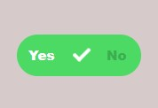
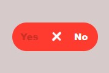

# Custom Radio Button Collection 📻✨

Welcome to the Custom Radio Button Collection repository! 🎉 If you're looking to spice up your forms with stylish and interactive radio buttons, you've come to the right place! 🌟

## What's Inside?

Inside this repository, you'll discover a variety of custom-designed radio buttons to suit any design aesthetic. Here's what you'll find:

- **Radio Buttons**: A diverse collection of radio button styles, from minimalist to colorful and beyond.
- **HTML & CSS**: Code snippets demonstrating how to implement each custom radio button style in your web forms.

## How to Use?

Using our custom radio buttons in your projects is a breeze! Just follow these simple steps:

1. Browse through the collection to find a radio button style that matches your project's design.
2. Copy the corresponding HTML and CSS code snippet into your project files.
3. Customize the radio button further by adjusting colors, sizes, and animations to fit your needs.
4. Integrate optional JavaScript features for enhanced interactivity, such as hover effects or click animations.

With our custom radio buttons, you can transform mundane forms into engaging user experiences! 🌈✨

## Sneakpeak

## Get in Touch

Got questions, feedback, or want to share how you've used our custom radio buttons in your projects? We'd love to hear from you! Connect with us on [GitHub](https://github.com/shivamgpt812). Let's collaborate and create delightful user interfaces together! 💬🌐

Happy styling! 📻💻
