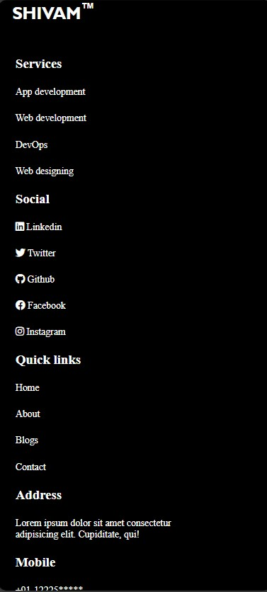

# Responsive Footer Collection 🦶✨

Welcome to the Responsive Footer Collection repository! 🎉 Enhance your website's footer with our beautifully designed, fully responsive footer templates. 🌟

## What's Inside?

This repository offers a variety of responsive footer designs that can easily be integrated into any web project. Here's what you'll find:

- **Footer Designs**: A range of styles to suit different types of websites, from simple to complex.
- **HTML & CSS**: Code snippets to help you implement each footer design seamlessly.

## How to Use?

Integrating these responsive footers into your website is a breeze! Just follow these steps:

1. Browse through the collection to find a footer design that complements your website.
2. Copy the corresponding HTML and CSS code snippets into your project files.
3. Customize the footer further by adjusting colors, fonts, and layouts to align with your brand.
4. Optionally, add JavaScript for features like smooth scrolling or dynamic content loading.

With these responsive footers, your website's bottom section will look stunning on any device! 🌐📱💻

## SneakPeek

Get a sneak peek at the beautiful footer designs included in this collection:

- **Simple Footer**: Clean and minimalistic, ideal for modern websites.
- **Social Media Footer**: Includes icons for social media links, perfect for connecting with your audience.
- **Contact Info Footer**: Displays contact details prominently for easy access.
- **Multi-column Footer**: Organizes content into multiple columns for a comprehensive layout.

## Get in Touch

Have questions, feedback, or want to share how you've used our footers in your projects? We'd love to hear from you! Connect with us on [GitHub](https://github.com/shivamgpt812). Let's collaborate and create stunning web experiences together! 💬🌐

Happy designing! 🦶💻
