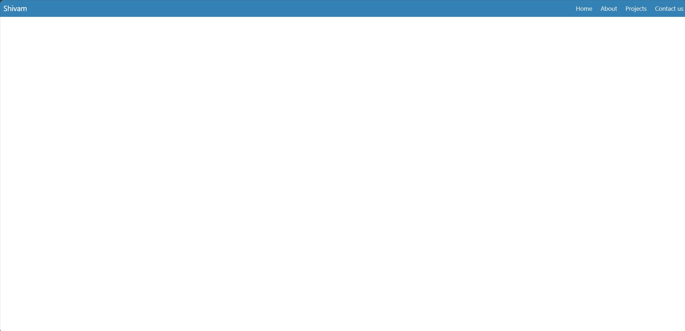

# Responsive Navbar 🚀✨

Welcome to the Responsive Navbar repository! 🎉 Elevate your website's navigation with our beautifully designed, fully responsive navbar. 🌟

## What's Inside?

This repository offers a variety of responsive navbar designs that can be seamlessly integrated into any web project. Here's what you'll find:

- **Navbar Design**: A range of styles to suit different types of websites, from simple to complex.
- **HTML & CSS**: Code snippets to help you implement each navbar design effortlessly.

## How to Use?

Integrating these responsive navbars into your website is easy! Just follow these steps:

1. Browse through the collection to find a navbar design that fits your website's style.
2. Copy the corresponding HTML and CSS code snippets into your project files.
3. Customize the navbar further by adjusting colors, fonts, and layouts to match your brand.
4. Optionally, add JavaScript for features like dropdown menus, responsive toggles, or animations.

With these responsive navbars, your website's navigation will look amazing on any device! 🌐📱💻

## SneakPeek

Get a sneak peek at the stunning navbar designs included in this collection:

- **Simple Navbar**: Clean and minimalistic, perfect for modern websites.
- **Dropdown Navbar**: Includes dropdown menus for easy access to sub-pages.
- **Sticky Navbar**: Remains fixed at the top as you scroll down the page.
- **Animated Navbar**: Features smooth animations for a sleek user experience.
- **Hamburger Menu Navbar**: Collapsible menu for mobile devices, providing a compact navigation solution.

## Get in Touch

Have questions, feedback, or want to share how you've used our navbars in your projects? We'd love to hear from you! Connect with us on [GitHub](https://github.com/shivamgpt812). Let's collaborate and create amazing web experiences together! 💬🌐

Happy navigating! 🚀💻