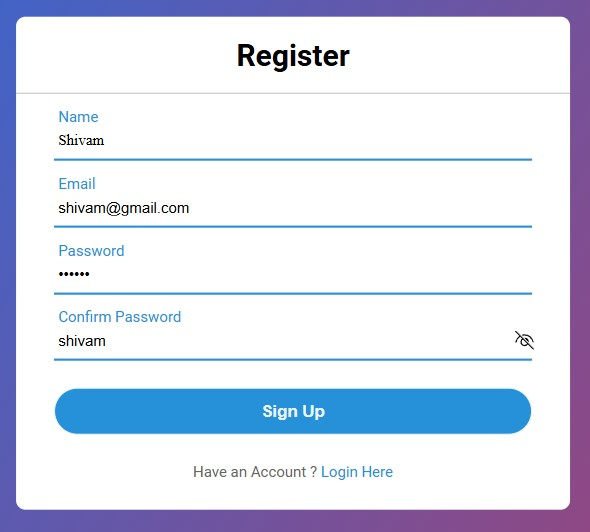

# Sign-Up Page 📝

Sign-Up Page is a simple web page designed for user registration.

## Preview 🖼️

## Technologies Used 🛠️

- HTML
- CSS

## Features ✨

- Input fields for user details such as username, email, password, etc.
- Option to include additional features like terms of service agreement checkbox or sign-in link.
- Customizable styling to match your website's theme.
- Optional JavaScript for client-side form validation or other dynamic functionality.

## Usage 🚀

1. Open the `index.html` file in a web browser to view the sign-up page.
2. Fill in the required user details to register.
3. Optionally, include additional features like agreeing to terms of service or linking to a sign-in page.

## Contributing 🤝

Contributions are welcome! If you find any issues or have suggestions for improvements, feel free to open an issue or create a pull request.

## License 📝

This project is licensed under the MIT License.
