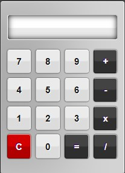

# Simple Calculator 🧮

Simple Calculator is a basic calculator application built for performing arithmetic calculations.

## Preview 🖼️

## Technologies Used 🛠️

- HTML
- CSS

## Features ✨

- Supports addition, subtraction, multiplication, and division operations.
- Simple and intuitive user interface.
- Responsive design for use on various devices.
- Clear button to reset the calculator.

## Usage 🚀

1. Open the `index.html` file in a web browser to launch the calculator.
2. Enter numbers and select operations using the on-screen buttons.
3. Press the "=" button to see the result of the calculation.
4. Use the "C" button to clear the input and start a new calculation.

## Contributing 🤝

Contributions are welcome! If you find any issues or have suggestions for improvements, feel free to open an issue or create a pull request.

## License 📝

This project is licensed under the MIT License.