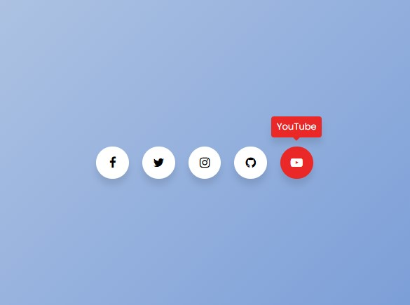

# Social Media Icons 🌐

Social Media Icons is a collection of stylish and customizable icons for popular social media platforms.

## Preview 🖼️

## Technologies Used 🛠️

- HTML
- CSS

## Features ✨

- Icons for popular social media platforms like Facebook, Twitter, Instagram, etc.
- Stylish and modern design.
- Easy to integrate into any web project.
- Customizable colors, sizes, and styles.

## Usage 🚀

1. Include the necessary HTML markup for the icons in your project.
2. Customize the colors, sizes, and styles of the icons to match your project's design.
3. Optionally, use CSS or JavaScript to add hover effects or other interactive features to the icons.

## Contributing 🤝

Contributions are welcome! If you find any issues or have suggestions for improvements, feel free to open an issue or create a pull request.

## License 📝

This project is licensed under the MIT License.
