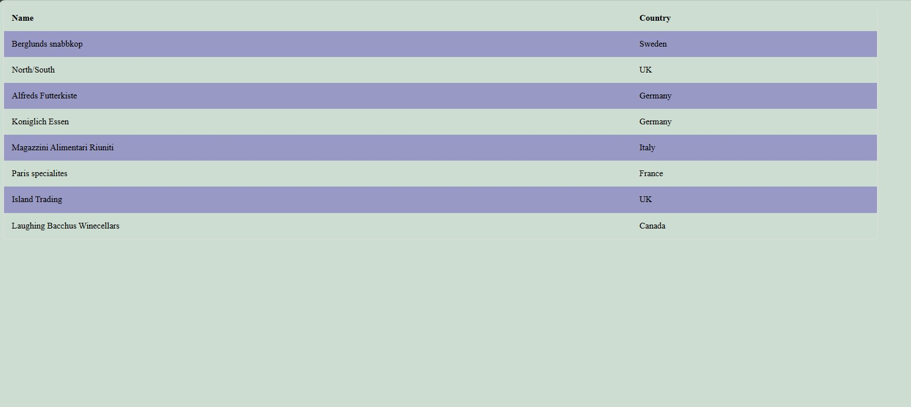

# Sortable HTML Table by Header Click 📊✨

Welcome to the Sortable HTML Table project! 🎉 Easily enhance your data tables with our interactive sorting feature, allowing users to sort table columns by simply clicking the headers. 🌟

## Overview

This repository contains an HTML table with a sorting feature that can be seamlessly integrated into any web project. Users can click on the table headers to sort the data in ascending or descending order.

## Features

- **Interactive Sorting**: Click on any column header to sort the data in that column.
- **Ascending and Descending**: Toggle between ascending and descending order with each click.
- **Responsive Design**: Works flawlessly on both desktop and mobile devices.
- **Customizable**: Easily adjust the styles to fit your website's design.

## Installation

To integrate the sortable table into your project, follow these steps:

1. **Clone the Repository**:
    ```sh
    git clone https://github.com/shivamgpt812/sortable-html-table.git
    ```

2. **Include the Files**:
    Add the HTML, CSS, and JavaScript files to your project directory.

3. **Link the CSS and JavaScript**:
    In your HTML file, include the CSS stylesheet and the JavaScript file:
    ```html
    <link rel="stylesheet" href="style.css">
    <script src="script.js" defer></script>
    ```

4. **Add the HTML Markup**:
    Insert the table structure into your webpage
## Customization

You can easily customize the table to fit your website's style. Here are some common customizations:

- **Styles**: Modify the CSS to change the appearance of the table and headers.
- **Columns**: Adjust the table headers and data to suit your specific needs.
- **Sorting Logic**: Enhance the JavaScript sorting logic to handle different data types or custom sorting criteria.

## SneakPeek

Check out the sortable HTML table in action:

- **Click to Sort**: Simply click on any column header to sort the table.
- **Toggle Order**: Click again to toggle between ascending and descending order.
- **Responsive Design**: The table adjusts perfectly to different screen sizes.



## Get in Touch

Have questions, feedback, or want to share how you've used our sortable table in your projects? We'd love to hear from you! Connect with us on or [GitHub](https://github.com/shivamgpt812). Let's collaborate and create amazing web experiences together! 💬🌐

Happy sorting! 📊💻
