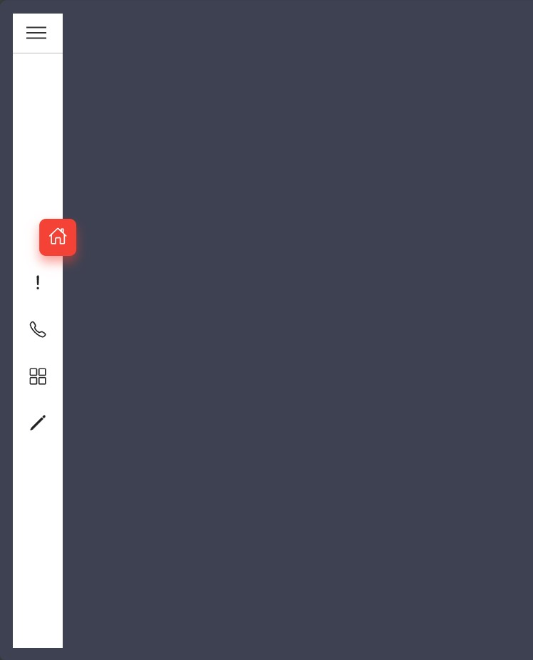
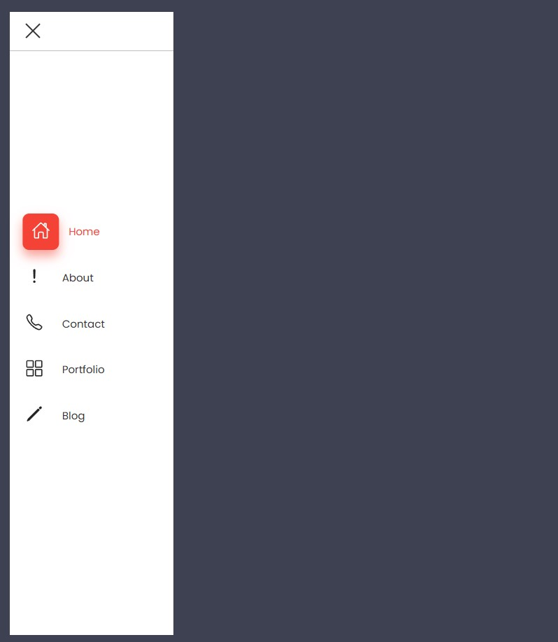

# Stylish Sidebar Menu 📋✨

Welcome to the Stylish Sidebar Menu repository! 🎉 Enhance your website's navigation with our beautifully designed, fully responsive sidebar menu. 🌟

## Overview

This repository contains a sleek and modern sidebar menu that can be seamlessly integrated into any web project. Our sidebar menu is designed to provide an intuitive and visually appealing navigation experience for users on both desktop and mobile devices.

## Features

- **Modern Design**: Clean and minimalistic, perfect for contemporary websites.
- **Responsive Layout**: Adapts seamlessly to different screen sizes and devices.
- **Customizable**: Easily adjust colors, fonts, and layouts to match your brand.
- **Interactive Elements**: Optional JavaScript enhancements for smooth animations and dynamic content.

## Installation

To integrate the stylish sidebar menu into your project, follow these steps:

1. **Clone the Repository**:
    ```sh
    git clone https://github.com/shivamgpt812/stylish-sidebar-menu.git
    ```

2. **Include the Files**:
    Add the HTML, CSS, and optional JavaScript files to your project directory.

3. **Link the CSS**:
    In your HTML file, include the CSS stylesheet:
    ```html
    <link rel="stylesheet" href="style.css">
    ```

4. **Add the HTML Markup**:
    Insert the sidebar menu's HTML structure into your webpage.

5. **Enhance with JavaScript (Optional)**:
    For additional interactivity, include the JavaScript file:
    ```html
    <script src="script.js"></script>
    ```

## Customization

You can easily customize the sidebar menu to fit your website's style. Here are some common customizations:

- **Colors**: Modify the color scheme in the CSS file.
- **Fonts**: Change the font family and size to match your brand's typography.
- **Layout**: Adjust the width, padding, and margins to fit your design requirements.
- **Animations**: Enhance user interaction with smooth transitions and hover effects using CSS or JavaScript.

## SneakPeek

Get a sneak peek at the stylish sidebar menu included in this project:

- **Modern Design**: Clean and minimalistic, perfect for modern websites.
- **Fixed Position**: Stays in place as you scroll through the content.
- **Responsive Layout**: Looks great on both desktop and mobile devices.
- **Easy Customization**: Adjust colors, fonts, and layouts to fit your brand.




## Get in Touch

Have questions, feedback, or want to share how you've used our sidebar menu in your projects? We'd love to hear from you! Connect with us on [GitHub](https://github.com/shivamgpt812). Let's collaborate and create amazing web experiences together! 💬🌐

Happy navigating! 📋💻