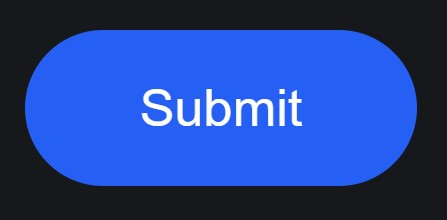
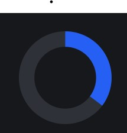
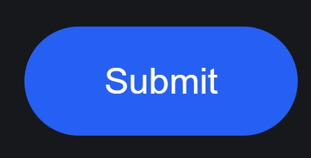

# Stylish Submit Button 🚀✨

Welcome to the Stylish Submit Button repository! 🎉 Elevate your forms with our sleek and eye-catching submit button component. 🌟

## Overview

This repository provides a customizable and visually appealing submit button solution for web forms. With its modern design and smooth animations, our submit button enhances user interaction and adds a touch of elegance to your forms.

## Features

- **Modern Design**: A clean and stylish submit button that enhances the overall look of your forms.
- **Smooth Animations**: Enjoy seamless transitions and hover effects for a polished user experience.
- **Customizable**: Easily adjust colors, sizes, and styles to match your website's branding.
- **Accessible**: Designed with accessibility in mind, ensuring a smooth experience for all users.

## Installation

To integrate the Stylish Submit Button into your project, follow these steps:

1. **Clone the Repository**:
    ```sh
    git clone https://github.com/shivamgpt812/stylish-submit-button.git
    ```

2. **Include the Necessary Files**:
    Add the HTML, CSS, and JavaScript files from the repository to your project directory.

3. **Link the CSS and JavaScript**:
    In your HTML file, include the CSS stylesheet and the JavaScript file:
    ```html
    <link rel="stylesheet" href="styles.css">
    <script src="script.js" defer></script>
    ```

4. **Add the HTML Markup**:
    Insert the submit button's HTML structure into your form where you want the button to appear.

## Customization

You can easily customize the Stylish Submit Button to fit your website's style:

- **Colors**: Modify the CSS to change the button's color scheme.
- **Sizes**: Adjust the dimensions of the button to fit your layout.
- **Hover Effects**: Add or modify hover effects for a more interactive experience.
- **Icons**: Optionally include icons to accompany the button text.

## SneakPeek

Get a sneak peek at the Stylish Submit Button included in this project:

- **Modern Design**: Clean and elegant, perfect for enhancing your forms.
- **Smooth Animations**: Enjoy seamless transitions and hover effects for a polished look.
- **Customizable**: Easily adapt the button to match your website's branding and style.





## Get in Touch

Have questions, feedback, or want to share how you've used our Stylish Submit Button in your projects? We'd love to hear from you! Connect with us on [GitHub](https://github.com/shivamgpt812). Let's collaborate and create amazing web experiences together! 💬🚀

Happy submitting! 📝✨