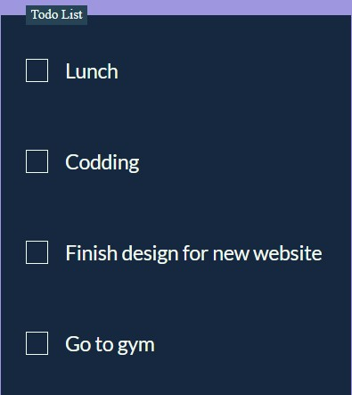
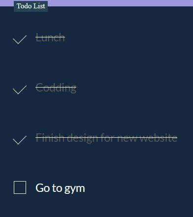

# To-Do List 📝✅

Welcome to the To-Do List repository! 🎉 Stay organized and manage your tasks effectively with our simple and intuitive to-do list application. 🌟

## Overview

This repository provides a customizable and user-friendly to-do list solution for keeping track of tasks and staying productive. Whether you're managing personal errands, work projects, or daily reminders, our to-do list app helps you stay organized and focused.

## Features

- **Simple Interface**: An easy-to-use interface for adding, editing, and completing tasks.
- **Task Management**: Organize tasks into categories, set priorities, and mark them as completed.
- **Customization**: Personalize your to-do list with colors, themes, and sorting options.
- **Sync Across Devices**: Access your to-do list from anywhere, with optional synchronization features.

## Installation

To use the To-Do List app, follow these steps:

1. **Clone the Repository**:
    ```sh
    git clone https://github.com/yourusername/to-do-list.git
    ```

2. **Set Up Environment**:
    Ensure you have a compatible web server environment

3. **Configuration**:
    Update the database connection settings in the application configuration file to match your environment.

4. **Deploy**:
    Upload the application files to your web server and navigate to the appropriate URL to access the to-do list app.

## Usage

Once the app is installed and running, you can start using it to manage your tasks:

1. **Add Tasks**: Enter new tasks into the input field and press Enter to add them to your to-do list.
2. **Edit Tasks**: Click on a task to edit its title or details inline.
3. **Mark as Completed**: Check off tasks when they are completed to move them to the completed list.
4. **Delete Tasks**: Remove tasks from your to-do list by clicking on the delete icon.
5. **Organize**: Use categories, priorities, and sorting options to organize and prioritize your tasks effectively.

## SneakPeek

Get a sneak peek at the To-Do List app included in this project:

- **Simple Interface**: Clean and intuitive, making task management effortless.
- **Task Management**: Easily add, edit, complete, and delete tasks as needed.
- **Customizable**: Tailor the app to your preferences with customizable themes and sorting options.




## Get in Touch

Have questions, feedback, or want to share how you've used our To-Do List app in your daily routine? We'd love to hear from you! Connect with us on [GitHub](https://github.com/yourusername). Let's collaborate and create productivity solutions together! 💬📝

Happy tasking! ✅✨
